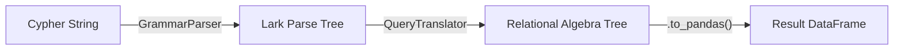

# Parse Tree to Relational Algebra Translation Guide

## Overview

This document explains the translation of grammar_parser parse trees into execution-ready relational algebra operations. This process enables the actual execution of Cypher queries on dataframes.

While the AST translation guide explains how to produce typed Pydantic models from the parse tree, the **Relation Algebra** module (`relational_algebra.py`) takes a different approach: it translates the Lark parse tree directly into an execution plan composed of algebraic operators like `Scan`, `Filter`, `Join`, and `Project`.

## The Execution Pipeline



## Implemented Algebraic Operators

The current implementation provides four fundamental operators from relational calculus:

1. **`Scan`**: Reads a base table (Entity or Relationship). Leaf node of execution plan.
2. **`Filter`**: Selecting rows based on conditions (`WHERE` clauses).
3. **`Join`**: Combining two tables based on common columns (`MATCH` patterns).
4. **`Project`**: Selecting specific columns (`RETURN` clauses).

### Variable Binding & Column Hashing

Execute query safety requires handling variable scope and column naming. The implementation uses **Column Hashing**:

1. Every column in every table is assigned a unique random hash (e.g., `name` → `a1b2...`).
2. Operators pass dataframes with these hashed names.
3. The `QueryTranslator` maintains a mapping of Cypher variables to these hashes.

This prevents naming collisions when joining a table to itself (e.g., `MATCH (a:Person)-[:KNOWS]->(b:Person)`).

## Translation Process: Step-by-Step

### 1. MATCH Clause (Table Scanning & Joining)

The `_translate_match` method converts patterns into `Scan` and `Join` operations.

**Input Cypher:**
```cypher
MATCH (p:Person)
```

**Translation Logic:**
1. Identify the node variable `p` and label `Person`.
2. Look up the `EntityTable` for "Person".
3. Create a **`Scan`** operator.
4. Record that variable `p` binds to the `Person` table's identifier column.

**Algebraic Result:**
```python
Scan(table_type="Person", variable="p", is_entity=True)
```

--------------------------------------------------------------------------------

**Input Cypher (Multi-node / Cartesian Product):**
```cypher
MATCH (p:Person), (c:Company)
```

**Translation Logic:**
1. Create `Scan` for Person `p`.
2. Create `Scan` for Company `c`.
3. Combine them using a **`Join`** (Cross Product / Inner Join).
    * *Note: Current implementation defaults to INNER JOIN behavior.*

**Algebraic Result:**
```python
Join(
    left=Scan(table_type="Person", variable="p"),
    right=Scan(table_type="Company", variable="c"),
    join_type=JoinType.INNER
)
```

### 2. WHERE Clause (Filtering)

The `_translate_where` method wraps the current operator tree in **`Filter`** operators.

**Input Cypher:**
```cypher
MATCH (p:Person) WHERE p.age > 30
```

**Translation Logic:**
1. Parse expression `p.age > 30`.
2. Resolve `p.age`:
   - Look up variable `p` in scope → maps to Person table.
   - Look up attribute `age` in Person table → get column hash `h_age`.
3. Create **`Filter`** operator wrapping the `Scan`.

**Algebraic Result:**
```python
Filter(
    input=Scan(...),
    attribute="age",
    operator=">",
    value=30
)
```

**Implemented Operators:**
- `=` (Equality)
- `>` (Greater Than)
- `<` (Less Than)
- `>=` (Greater Than or Equal)
- `<=` (Less Than or Equal)
- `!=` (Not Equal)

### 3. RETURN Clause (Projection)

The `_translate_return` method adds **`Project`** operators to select the final columns.

**Input Cypher:**
```cypher
RETURN p.name, p.city
```

**Translation Logic:**
1. Identify expressions `p.name` and `p.city`.
2. Resolve to column hashes.
3. Create **`Project`** operator.

**Algebraic Result:**
```python
Project(
    input=...,
    columns=["hash_for_name", "hash_for_city"]
)
```

## Example Walkthrough

**Query:**
```cypher
MATCH (n:Person) WHERE n.age > 25 RETURN n.name
```

**Parse Tree (Simplified):**
- `query_statement`
    - `match_clause`: `(n:Person)`
    - `where_clause`: `n.age > 25`
    - `return_clause`: `n.name`

**Step 1: MATCH Translation**
- Translator finds `(n:Person)`.
- Context check: "Person" exists.
- Action: Create `Scan("Person", variable="n")`.
- Scope update: `n` → `Person` ID hash.

**Step 2: WHERE Translation**
- Translator finds `n.age > 25`.
- Resolution: `n` refers to the Scan output. `age` maps to internal hash `x9f2...`.
- Action: Create `Filter(input=Scan, attribute="age", op=">", value=25)`.

**Step 3: RETURN Translation**
- Translator finds `n.name`.
- Resolution: `name` maps to internal hash `y3k8...`.
- Action: Create `Project(input=Filter, columns=["y3k8..."])`.

**Final Execution Plan:**
```text
Project (columns=[name])
  |
  +-- Filter (age > 25)
        |
        +-- Scan (table=Person)
```

## What Remains to be Implemented

The current `relational_algebra.py` contains a solid foundation but leaves several key Cypher features for future implementation:

1.  **Relationship Patterns (`-[r:TYPE]->`)**:
    -   *Current Status*: `_translate_relationship_pattern` raises `NotImplementedError`.
    -   *Missing*: Logic to scan Relationship tables and join them with source/target Node tables.

2.  **Complex WHERE Logic**:
    -   *Current Status*: Only supports simple binary comparisons (e.g., `a.prop > 5`).
    -   *Missing*: Boolean logic (`AND`, `OR`, `NOT`, `XOR`), `IN` operator, string matching (`STARTS WITH`), and complex nested expressions.

3.  **Advanced Projections**:
    -   *Current Status*: Simple property access (`n.prop`).
    -   *Missing*: Aggregations (`COUNT`, `SUM`), Aliasing (`AS`), `DISTINCT`, `ORDER BY`, `LIMIT`, `SKIP`.

4.  **Property Setting**:
    -   *Current Status*: Read-only (MATCH/RETURN).
    -   *Missing*: `CREATE`, `MERGE`, `SET`, `DELETE`.

5.  **Pattern Joins**:
    -   *Current Status*: Basic cross-product style joins for unconnected nodes.
    -   *Missing*: Intelligent join planning for connected patterns (once relationships are implemented).

## Summary

The `relational_algebra.py` module provides a working proof-of-concept for executing Cypher queries. It successfully bridges the gap between the Lark parse tree and dataframe operations for single-node patterns with basic filtering and projection.
