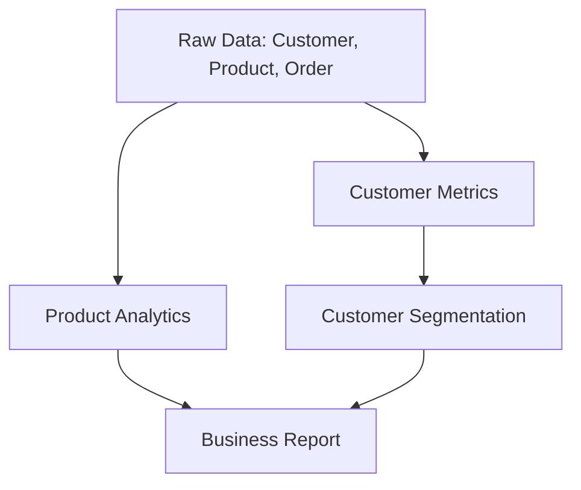

# Retail Analytics ETL Pipeline

A complete ETL pipeline demonstrating **query composition with dependencies** using PyCypher. This example shows how to build a multi-stage analytics pipeline where each query depends on the results of previous queries.

## Business Scenario

Transform raw e-commerce data into actionable business insights through a 4-stage ETL pipeline:

1. **Data Ingestion** → Load raw customer, order, and product data
2. **Data Enrichment** → Calculate customer metrics (total spend, order frequency)
3. **Customer Segmentation** → Classify customers into value-based segments
4. **Business Analytics** → Generate executive reports and insights

## Data Model

```
┌─────────────────┐    ┌─────────────────┐    ┌─────────────────┐
│    Customer     │    │     Product     │    │  CustomerOrder  │
├─────────────────┤    ├─────────────────┤    ├─────────────────┤
│ customer_id(pk) │    │ product_id(pk)  │    │ order_id(pk)    │
│ name            │    │ name            │    │ customer_id(fk) │
│ email           │    │ category        │    │ product_id(fk)  │
│ city            │    │ price           │    │ quantity        │
│ signup_date     │    └─────────────────┘    │ order_date      │
└─────────────────┘                           │ unit_price      │
                                              └─────────────────┘
```

**Derived Entities** (created by pipeline):
- `CustomerMetrics` → total_spend, order_count, avg_order_value, days_since_last_order
- `CustomerSegment` → segment classification (VIP, Regular, At-Risk, New)
- `BusinessReport` → executive summary metrics

## Pipeline Stages

### Stage 1: Data Enrichment
Calculate customer behavior metrics from raw order data.

**Dependencies**: CustomerOrder → Customer
**Creates**: CustomerMetrics entity

### Stage 2: Customer Segmentation
Classify customers based on RFM analysis (Recency, Frequency, Monetary value).

**Dependencies**: CustomerMetrics
**Creates**: CustomerSegment entity

### Stage 3: Product Analytics
Analyze product performance and category trends.

**Dependencies**: CustomerOrder → Product
**Creates**: ProductAnalytics entity

### Stage 4: Business Reporting
Generate executive dashboard data combining all insights.

**Dependencies**: CustomerSegment + ProductAnalytics
**Creates**: BusinessReport entity

## Quick Start

### Method 1: Programmatic Python Execution
```bash
# From the monorepo root - comprehensive logging and debugging
uv run python examples/retail_analytics/run_pipeline.py
```

### Method 2: Declarative YAML CLI Execution
```bash
# Navigate to tutorial directory (required for correct path resolution)
cd examples/retail_analytics

# Run with verbose output to see execution progress
uv run python -m pycypher.nmetl_cli run pipeline.yaml --verbose

# Available CLI options:
# --dry-run          : Preview execution plan without running queries
# --query-id <id>    : Run only specific queries (e.g., --query-id customer_metrics)
# --on-error [fail|warn|skip] : Error handling policy
```

**Both methods produce identical results** - choose based on your workflow preference.

## What You'll See

The pipeline will execute queries in dependency order:

1. **Customer Enrichment** → "Calculating customer metrics..."
2. **Customer Segmentation** → "Classifying 50 customers into segments..."
3. **Product Analytics** → "Analyzing performance across 4 categories..."
4. **Business Reporting** → "Generated executive summary with key insights"

**Final Output**: `output/executive_report.csv` with business KPIs

## Pipeline Dependencies



## Key Learning Points

- **Query Composition** → How queries build upon each other's results
- **Dependency Management** → Automatic execution ordering based on entity dependencies
- **Data Transformation** → Multi-stage analytics pipeline patterns
- **Error Handling** → Robust pipeline execution with configurable error policies
- **Output Management** → Multiple output formats and destinations
- **Dual Execution Modes** → Programmatic Python vs. declarative YAML approaches

## Execution Method Comparison

| Feature | Python Script | YAML CLI |
|---------|---------------|----------|
| **Logging** | Detailed with emojis | Clean, structured |
| **Debugging** | Built-in data inspection | Standard error messages |
| **Configuration** | Embedded in Python | External YAML file |
| **Path Resolution** | Absolute from project root | Relative to YAML file |
| **Working Directory** | Any (uses absolute paths) | Must be in tutorial directory |
| **Error Handling** | Python exception handling | Configurable CLI policies |
| **Production Use** | Development/debugging | Production pipelines |

## Files Structure

```
examples/retail_analytics/
├── README.md                    ← This file
├── run_pipeline.py              ← Programmatic pipeline execution
├── pipeline.yaml                ← Declarative YAML configuration (CLI-compatible)
├── validate_tutorial.py         ← Automated validation script
├── queries/                     ← External Cypher query files
│   ├── customer_metrics.cypher
│   ├── customer_segmentation.cypher
│   ├── product_analytics.cypher
│   ├── business_report.cypher        ← Original (complex)
│   └── business_report_simple.cypher ← CLI-compatible version
├── data/                        ← Sample CSV data files
│   ├── customers.csv           ← 50 customers across 5 cities
│   ├── products.csv            ← 20 products across 4 categories
│   └── orders.csv              ← 200 orders spanning 2 years
└── output/                     ← Pipeline results (created on run)
    ├── customer_metrics.csv    ← Generated by both execution methods
    ├── customer_segments.csv
    ├── product_performance.csv
    └── executive_report.csv
```

### YAML Configuration Structure

The `pipeline.yaml` uses the correct nmetl CLI format:

```yaml
sources:
  entities:
    - id: customers
      uri: "data/customers.csv"     # Relative to pipeline.yaml
      entity_type: Customer
      id_col: customer_id

queries:
  - id: customer_metrics
    source: "queries/customer_metrics.cypher"  # No nested output

# Separate top-level output section (required for CLI)
output:
  - query_id: customer_metrics
    uri: "output/customer_metrics.csv"
```

## Troubleshooting

### Common Issues

**CLI Error: "No such file or directory"**
- ✅ **Solution**: Must run CLI from the `examples/retail_analytics/` directory
- ❌ Wrong: `uv run python -m pycypher.nmetl_cli run examples/retail_analytics/pipeline.yaml`
- ✅ Correct: `cd examples/retail_analytics && uv run python -m pycypher.nmetl_cli run pipeline.yaml`

**CLI Error: "unhashable type: 'list'"**
- ✅ **Solution**: Use `business_report_simple.cypher` (already configured in pipeline.yaml)
- Complex `collect()` operations in the original `business_report.cypher` cause CLI type errors

**Python Script Error: "customer_id values are None"**
- ✅ **Solution**: Use `ID(entity)` instead of `entity.property_name` for joins
- Fixed pattern: `WHERE o.customer_id = customer_id` (after WITH clause)

### Verifying Success

**Automated Validation:**
```bash
# Run comprehensive validation of both execution methods
cd examples/retail_analytics
uv run python validate_tutorial.py
```

**Expected Results:**
Both execution methods should produce:
- 50 customer records processed
- 4 output CSV files in `output/` directory
- Executive report showing $34,947.46 total revenue
- Identical results between Python and CLI execution

## Next Steps

After running this example:

- Modify the segmentation logic in `queries/customer_segmentation.cypher`
- Add new metrics to the business report
- Experiment with different dependency orders using `--query-id` CLI option
- Try the error handling features by introducing invalid queries
- Scale up with your own CSV data files
- Compare programmatic vs. CLI execution for your use case

This demonstrates the full power of PyCypher for complex, multi-stage ETL pipelines!